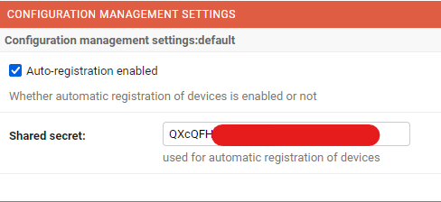

# Setting up the OpenWISP and OpenWRT infrastructure

## First, prepare 2 virtual machines:
- 1 machine running Debian 10, will be running OpenWISP
- 1 machine running OpenWRT, downloaded from https://downloads.openwrt.org/releases/21.02.0-rc3/targets/x86/64/

## Setting up OpenWISP 
### Installing OpenWISP
- Create a folder name `openwisp`
- Clone [ansible-openwisp2](https://github.com/openwisp/ansible-openwisp2) as `openwisp.openwisp2`
- Clone [Stouts.postfix](https://github.com/nemesisdesign/Stouts.postfix)
- Create `hosts` with the following contents:
```ini
[openwisp2]
<IP of the Debian VM>
```
- Create `playbook.yml` with the following contents:
```yaml
- hosts: openwisp2
  become: "{{ become | default('yes') }}"
  roles:
    - openwisp.openwisp2
  vars:
    openwisp2_controller_pip: "https://github.com/openwisp/openwisp-controller/tarball/master"
    openwisp2_utils_pip: "https://github.com/openwisp/openwisp-utils/tarball/master#egg=openwisp-utils[rest]"
    openwisp2_users_pip: "https://github.com/openwisp/openwisp-users/tarball/master#egg=openwisp-users[rest]"
    postfix_myhostname: localhost
    openwisp2_extra_django_settings:
      OPENWISP_USERS_AUTH_API: true
      OPENWISP_CONTROLLER_API: true
    openwisp2_extra_python_packages:
      - "djangorestframework==3.12.4"
    openwisp2_time_zone: "Asia/Ho_Chi_Minh" 
```
- Run the playbook:
```bash
$ ansible-playbook -i hosts playbook.yml -k --become -K
```

### Integrating `openwisp-monitoring`
- Install `influxdb` on the Debian VM:
```bash
# curl -s https://repos.influxdata.com/influxdb.key | gpg --dearmor > /etc/apt/trusted.gpg.d/influxdb.gpg
# export DISTRIB_ID=$(lsb_release -si); export DISTRIB_CODENAME=$(lsb_release -sc)
# echo "deb [signed-by=/etc/apt/trusted.gpg.d/influxdb.gpg] https://repos.influxdata.com/${DISTRIB_ID,,} ${DISTRIB_CODENAME} stable" > /etc/apt/sources.list.d/influxdb.list
# apt-get update && apt-get install influxdb
# systemctl unmask influxdb.service
# systemctl start influxdb
```
- Change directory into `/opt/openwisp2`
- Activate the virtual environment, and install `openwisp-monitoring` with `pip`, then collect the static files:
```bash
$ source env/bin/activate
$ pip install openwisp-monitoring
$ python manage.py collectstatic
```
- Edit `/opt/openwisp2/openwisp/settings.py`, add the `openwisp-monitoring` apps, database configurations and celery task:
```python
INSTALLED_APPS = [
  # other apps...
  # monitoring
  'openwisp_monitoring.monitoring',
  'openwisp_monitoring.device',
  'openwisp_monitoring.check',
  'nested_admin',
]

TIMESERIES_DATABASE = {
    'BACKEND': 'openwisp_monitoring.db.backends.influxdb',
    'USER': 'openwisp',
    'PASSWORD': 'openwisp',
    'NAME': 'openwisp2',
    'HOST': 'localhost',
    'PORT': '8086',
}

CELERY_BEAT_SCHEDULE = {
    # other tasks...
    'run_checks': {
        'task': 'openwisp_monitoring.check.tasks.run_checks',
        'schedule': timedelta(minutes=5),
    },
}
```
- Edit `/opt/openwisp2/openwisp/urls.py`, add the `openwisp-monitoring` urls:
```python
urlpatterns = [
    # other urls...
    url(r'', include('openwisp_monitoring.urls')),
]
```
- Restart `supervisor`:
```bash
$ sudo systemctl restart supervisor.service
```

## Setting up OpenWRT
- On the VM running OpenWRT, install `openwisp-config` and `lua-cjson`:
```bash
# opkg update
# opkg install  http://downloads.openwisp.io/openwisp-config/latest/openwisp-config-openssl_0.6.0a-1_all.ipk
# opkg install lua-cjson
```
- Edit `/etc/config/openwisp`, change `url`, `verify_ssl` and `shared_secret`:
```config
config controller 'http'
  option url '<IP of the VM running OpenWISP'
  option verify_ssl '0' # Self-signed cert
  option shared_secret '<secret, found in Organization tab of OpenWISP WebUI>'
```

- Restart `openwisp_config`:
```bash
# /etc/init.d/openwisp_config restart
```

